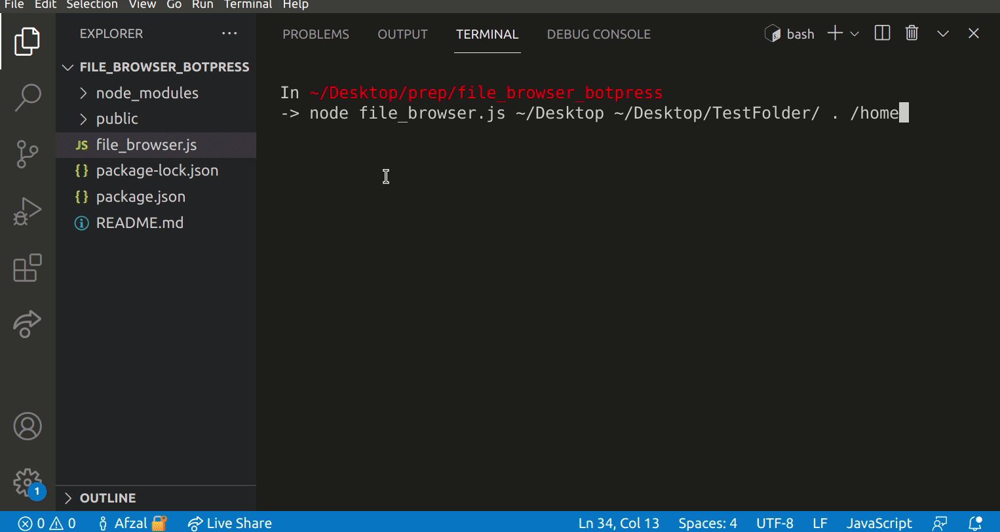
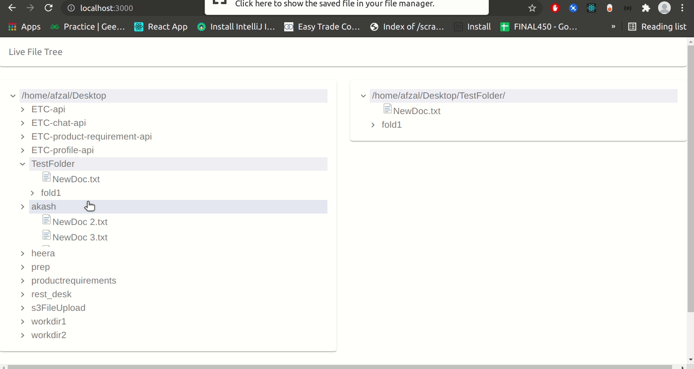

# Hi, I am Afzal.

> This project is a take home assignment from botpress. 

Problem statement: [Here](https://docs.google.com/document/u/3/d/1VtZ3lMS-ZEZnRbFpZLufpQH3eCCtl1hquVmAGQOb-Mw)


### Demo
<hr>

<br/><br>

Live File Rename Demo



### How to Run
<hr>

Please clone this repo and make sure you have node installed.

If you don't have node, please refer [this](https://nodejs.dev/learn/how-to-install-nodejs) doc to install.

<br/>

After cloning, open the repo directory in terminal and run:

```
node install
```
<br/>

Now run: (you pass can any number of directoies)

```
node file_browser.js <dir1> <dir1> <..dirN>
```
<br/>


Examples:
```
node file_browser.js ~/Desktop . ../

node file_browser.js /home ../..

node file_browser.js

(if no dir passed, it will work with current working dir)
```


